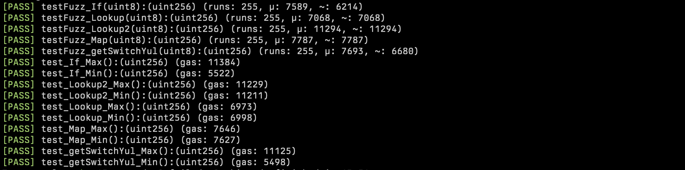

# Lookup Tables vs If Statements vs Mapping vs Yul Switch

This repository contains a smart contract Benchmark written in Solidity that is used to compare gas costs among three different methods of accessing data: lookup tables, if statements, mapping and yul switch.

## Gas Snapshot

| src/If.sol:If contract |                 |      |        |      |         |
|------------------------|-----------------|------|--------|------|---------|
| Deployment Cost        | Deployment Size |      |        |      |         |
| 1206454                | 6058            |      |        |      |         |
| Function Name          | min             | avg  | median | max  | # calls |
| getIf                  | 292             | 2247 | 292    | 6157 | 3       |

| src/Lookup.sol:Lookup contract |                 |      |        |      |         |
|--------------------------------|-----------------|------|--------|------|---------|
| Deployment Cost                | Deployment Size |      |        |      |         |
| 245687                         | 1259            |      |        |      |         |
| Function Name                  | min             | avg  | median | max  | # calls |
| getLookup                      | 1745            | 1745 | 1745   | 1745 | 3       |

| src/Lookup2.sol:Lookup2 contract |                 |      |        |      |         |
|----------------------------------|-----------------|------|--------|------|---------|
| Deployment Cost                  | Deployment Size |      |        |      |         |
| 665496                           | 3356            |      |        |      |         |
| Function Name                    | min             | avg  | median | max  | # calls |
| getLookup2                       | 5980            | 5980 | 5980   | 5980 | 3       |

| src/Map.sol:Map contract |                 |      |        |      |         |
|--------------------------|-----------------|------|--------|------|---------|
| Deployment Cost          | Deployment Size |      |        |      |         |
| 5703791                  | 238             |      |        |      |         |
| Function Name            | min             | avg  | median | max  | # calls |
| map                      | 2441            | 2441 | 2441   | 2441 | 3       |

| src/YulSwitch.sol:YulSwitch contract |                 |      |        |      |         |
|--------------------------------------|-----------------|------|--------|------|---------|
| Deployment Cost                      | Deployment Size |      |        |      |         |
| 449686                               | 2278            |      |        |      |         |
| Function Name                        | min             | avg  | median | max  | # calls |
| getSwitchYul                         | 300             | 2188 | 366    | 5899 | 3       |

