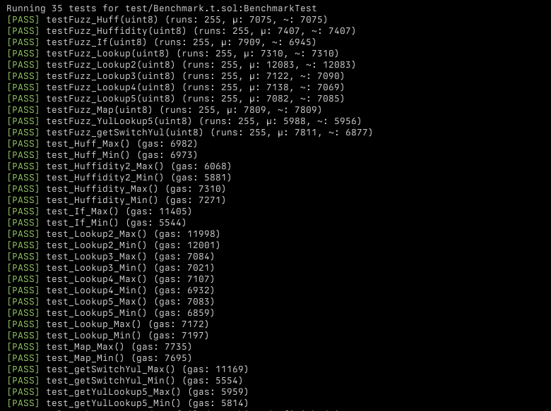

# `Lookup Tables` vs `If Statements` vs `Mapping` vs `Yul Switch` vs `Huffidity` vs `Huff`

This repository contains foundry benchmark tests written in Solidity that are used to compare gas costs amongs different methods of accessing data: lookup tables (5 versions), if statements, mapping, yul switch, 2 different approaches in huffidity (huff+solidity) and pure huff.

I had a wild idea/use case that needed to have access to 255 different 9 byte values so I decided to test out the different methods of accessing data to see which one was the most gas efficient.

## Gas Snapshot

## Comparison

### Huffidity

Adding huff code (JumpTable.huff) to the end of a solidity contract (HuffLib.sol).
The huff code is a jump table with 255 entries.

| src/HuffLib.sol:HuffLib contract |                 |      |        |      |         |
|----------------------------------|-----------------|------|--------|------|---------|
| Deployment Cost                  | Deployment Size |      |        |      |         |
| 2375207                          | 12045           |      |        |      |         |
| Function Name                    | min             | avg  | median | max  | # calls |
| jumpTable                        | 2014            | 2014 | 2014   | 2014 | 3       |

### Huffdity - Lookup5

A huffidity version of the Lookup5 code.

| src/HuffLib2.sol:HuffLib2 contract |                 |     |        |     |         |
|------------------------------------|-----------------|-----|--------|-----|---------|
| Deployment Cost                    | Deployment Size |     |        |     |         |
| 710775                             | 3853            |     |        |     |         |
| Function Name                      | min             | avg | median | max | # calls |
| lookup5_Huff                       | 612             | 702 | 702    | 793 | 2       |

### If

A solidity if statement with 255 branches.

| src/If.sol:If contract |                 |      |        |      |         |
|------------------------|-----------------|------|--------|------|---------|
| Deployment Cost        | Deployment Size |      |        |      |         |
| 1256506                | 6305            |      |        |      |         |
| Function Name          | min             | avg  | median | max  | # calls |
| getIf                  | 288             | 4190 | 6130   | 6153 | 3       |

### Lookup (1,2,3,4)

#### Lookup1

Concatenating 9 different lookup constants at [index] into a single return value

| src/Lookup.sol:Lookup contract |                 |      |        |      |         |
|--------------------------------|-----------------|------|--------|------|---------|
| Deployment Cost                | Deployment Size |      |        |      |         |
| 261098                         | 1333            |      |        |      |         |
| Function Name                  | min             | avg  | median | max  | # calls |
| getLookup                      | 1896            | 1896 | 1896   | 1896 | 3       |

#### Lookup2

A method of looking up a single large constant value and from indexes [index, index+8] and then concatenating the result into a single return value

| src/Lookup2.sol:Lookup2 contract |                 |      |        |      |         |
|----------------------------------|-----------------|------|--------|------|---------|
| Deployment Cost                  | Deployment Size |      |        |      |         |
| 671100                           | 3381            |      |        |      |         |
| Function Name                    | min             | avg  | median | max  | # calls |
| getLookup2                       | 6723            | 6723 | 6723   | 6723 | 3       |

#### Lookup3

Concatenating 18 different lookup constants at [index] into a single return value

| src/Lookup3.sol:Lookup3 contract |                 |      |        |      |         |
|----------------------------------|-----------------|------|--------|------|---------|
| Deployment Cost                  | Deployment Size |      |        |      |         |
| 389222                           | 1973            |      |        |      |         |
| Function Name                    | min             | avg  | median | max  | # calls |
| getLookup3                       | 1724            | 1753 | 1724   | 1812 | 3       |

#### Lookup4

Concatenating 36 different lookup constants at [index] into a single return value

| src/Lookup4.sol:Lookup4 contract |                 |      |        |      |         |
|----------------------------------|-----------------|------|--------|------|---------|
| Deployment Cost                  | Deployment Size |      |        |      |         |
| 440672                           | 2230            |      |        |      |         |
| Function Name                    | min             | avg  | median | max  | # calls |
| getLookup4                       | 1675            | 1727 | 1675   | 1831 | 3       |

#### Lookup5

Concatenating 72 different lookup constants at [index] into a single return value

| src/Lookup5.sol:Lookup5 contract |                 |      |        |      |         |
|----------------------------------|-----------------|------|--------|------|---------|
| Deployment Cost                  | Deployment Size |      |        |      |         |
| 547579                           | 2764            |      |        |      |         |
| Function Name                    | min             | avg  | median | max  | # calls |
| getLookup5                       | 1603            | 1716 | 1715   | 1831 | 3       |

### Mapping

A solidity storage mapping with 255 entries.

| src/Map.sol:Map contract |                 |      |        |      |         |
|--------------------------|-----------------|------|--------|------|---------|
| Deployment Cost          | Deployment Size |      |        |      |         |
| 5725548                  | 232             |      |        |      |         |
| Function Name            | min             | avg  | median | max  | # calls |
| map                      | 2438            | 2438 | 2438   | 2438 | 3       |

### YulSwitch

A yul switch statement with 255 branches.

| src/YulSwitch.sol:YulSwitch contract |                 |      |        |      |         |
|--------------------------------------|-----------------|------|--------|------|---------|
| Deployment Cost                      | Deployment Size |      |        |      |         |
| 439272                               | 2223            |      |        |      |         |
| Function Name                        | min             | avg  | median | max  | # calls |
| getSwitchYul                         | 297             | 2170 | 319    | 5896 | 3       |

### Huff - If

Pure huff version of the Huffidity Code, a jump table with 255 entries.

## Credits

* [solady-vs-huffidity (clabby)](https://github.com/clabby/solady-vs-huffidity/)
* [huffidity-poc (moodlezoup)](https://github.com/moodlezoup/huffidity-poc)

